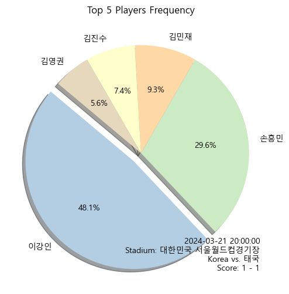

# 프로젝트 제목: Foolball-Frequency, Korea

## 프로젝트 개요
대한민국 A매치와 관련하여, 해외축구 갤러리와 같은 대형 온라인 커뮤니티에서 발생하는 대화와 팬들의 상호작용을 분석합니다. 이 프로젝트의 핵심 목적은 특정 경기나 이벤트를 중심으로 한국 국가대표팀 선수들에 대한 언급 빈도를 집계하고 분석함으로써, 선수들에 대한 대중의 관심과 반응을 관찰하는 것입니다.

## 배경
해외축구 갤러리는 전 세계적으로 수많은 축구 팬들이 모여 대화를 나누는 가장 큰 플랫폼 중 하나입니다. 이 공간에서 팬들은 경기에 대한 의견, 선수들의 퍼포먼스 평가, 팀 전략 등 다양한 주제에 대해 열띤 토론을 벌입니다. 선수가 언급되는 빈도가 높다는 것은 그만큼 대중의 관심을 많이 받고 있으며, 경기에서 눈에 띄는 활약으로 관심도가 늘어나기도 합니다. 이러한 데이터를 분석함으로써, 우리는 대중의 관심과 축구 문화의 흐름을 이해할 수 있습니다.

## 기능
- **데이터 크롤링**: 자동화된 스크립트를 통해 해외축구 갤러리에서 대량의 게시글 데이터를 수집합니다.
- **언급 빈도 집계**: 수집된 데이터 내에서 대한민국 국가대표 선수들이 언급된 횟수를 계산합니다.
- **데이터 시각화**: 언급 빈도 데이터를 파이 차트와 같은 시각화 도구를 사용하여 표현합니다.

## 예시
데이터 시각화


## 시작하기

### 필요 조건
- Python 3.x 설치
- 필요한 Python 라이브러리: `selenium`, `beautifulsoup4`, `pandas`, `numpy`, `matplotlib`, `konlpy`, `tensorflow`

### 설치 방법
프로젝트 코드를 복제하고 필요한 라이브러리를 설치합니다.
```bash
git clone https://github.com/20161609/Foolball-Frequency.git
pip install selenium webdriver_manager beautifulsoup4 pandas numpy matplotlib konlpy tensorflow
```

## 방법론
1. **데이터 수집**: Selenium과 BeautifulSoup을 사용하여 지정된 기간 동안 해외축구 갤러리에서 게시글 데이터를 크롤링합니다.
2. **데이터 처리**: 크롤링된 데이터 중에서 대한민국 국가대표 선수들의 이름이 포함된 게시글을 선별하고, A매치 경기 시간을 기준으로 36시간 내의 게시글을 추려냅니다.
3. **언급 빈도 집계**: 선별된 게시글 내에서 각 선수의 언급 빈도를 계산합니다.
4. **시각화**: 집계된 데이터를 바탕으로 파이 차트로 결과를 시각화합니다.